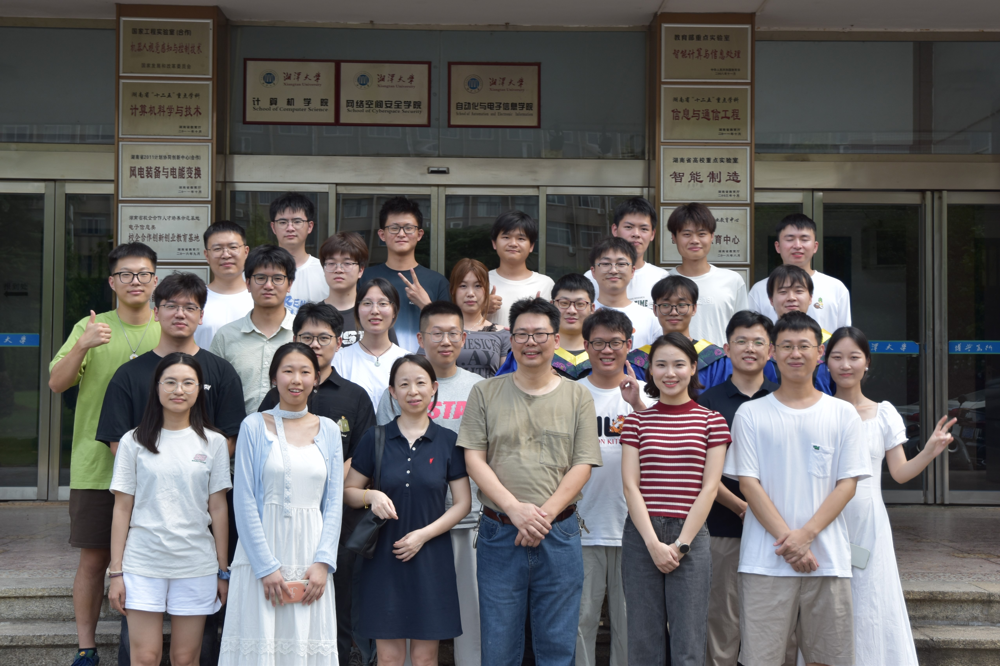

# Happy Computer Vision Lab

我们是来自湘潭大学的计算机视觉与人工智能研究团队，关注视觉感知、多模态学习、大模型应用与智能系统落地。

实验室主页链接：https://scs-happycv.github.io/lab-homepage/

  

  <a href="https://scs-happycv.github.io/lab-homepage/"><strong>访问实验室主页</strong></a>

## 研究方向

- 计算机视觉与视觉感知
- 多模态学习与图文理解
- 视觉大模型与智能体应用
- 面向真实场景的智能系统

## 联系方式

- 周维 教授：zhou_wei@xtu.edu.cn
- 许海霞 教授：haixiaxu@xtu.edu.cn
- 实验室地址：工科楼 N403 / S408
